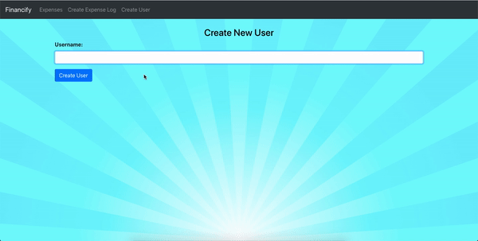
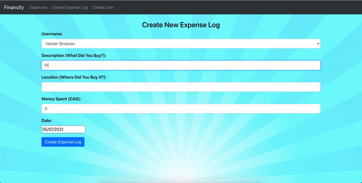
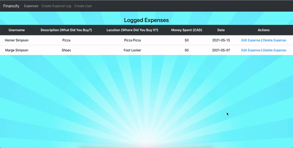

# FinanceTracker

* Built a full-stack web application using the MERN Stack that allows families to track their household expenses.
* Created a RESTful API with Express and Node.js to perform CRUD on expense logs in a MongoDB database.
* Implemented a responsive front-end using React to display/manage expenses and users.

## Application Overview

### Create a User

### Create a New Expense Log and View Existing Expense Logs

### Edit and Delete Existing Expense Logs

